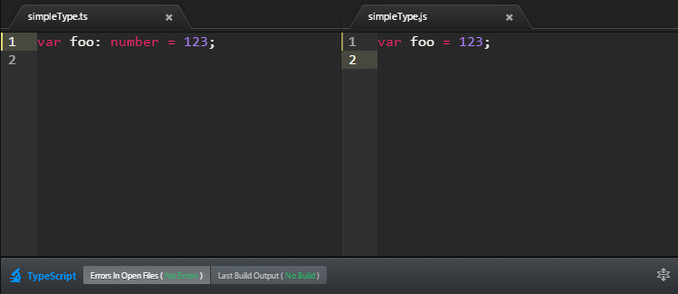

# Getting Started With TypeScript

TypeScript compiles into JavaScript. JavaScript is what you are actually going to execute (either in the browser or on the server). So you are going to need the following:

* TypeScript compiler (OSS available [in source](https://github.com/Microsoft/TypeScript/) and on [NPM](https://www.npmjs.com/package/typescript))
* A TypeScript editor (you can use notepad if you want but I use [Atom-TypeScript](https://atom.io/packages/atom-typescript))





## Getting the Source Code
The source for this book is available in the books github repository https://github.com/basarat/typescript-book/tree/master/code most of the code samples can be copied in to atom-typescript and run as is. For code samples that need additional setup (e.g. npm modules), we will link you to the code sample before presenting the code. e.g.

`this/will/be/the/link/to/the/code.ts`
```ts
// This will be the code under discussion
```

## Nightly TypeScript
Instead of using the official *stable* TypeScript compiler we will be presenting a lot of new stuff in this book that may not be released. For this purpose we recommend using nightly typescript versions.

```
npm install -g typescript@next
```

## TypeScript definitions
TypeScript has a concept of a *declaration file* for external JavaScript code bases. *High quality* files exist for nearly 90% of the top JavaScript libraries out there in a project called [DefinitelyTyped](http://definitelytyped.org/). You will need `typings` to get these defintions. Don't worry, we will explain what this means later ... just install for now:

```
npm install -g typings
```

With a dev setup out of the way lets jump into TypeScript syntax.
